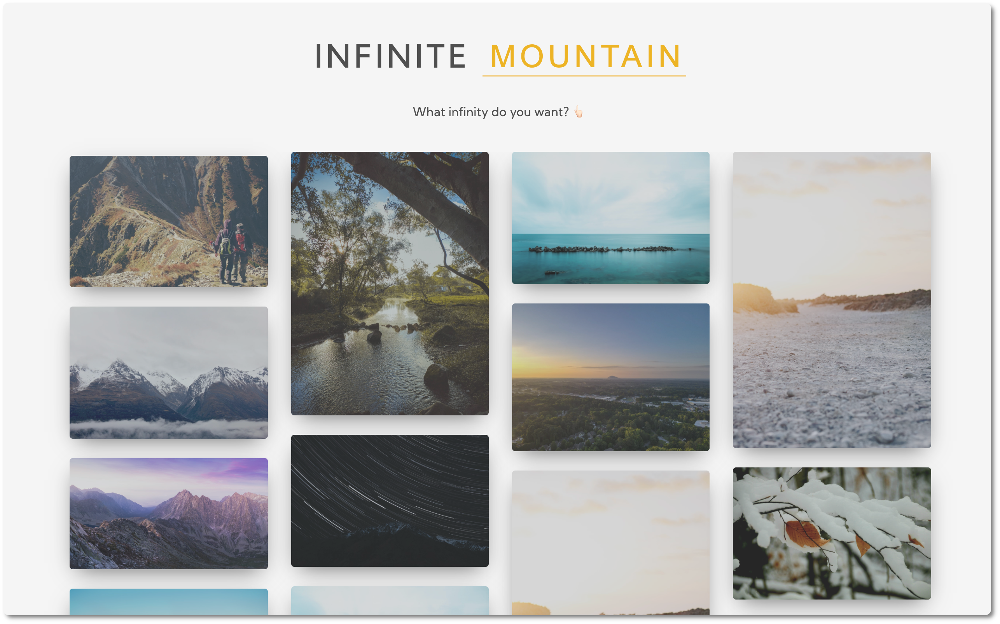
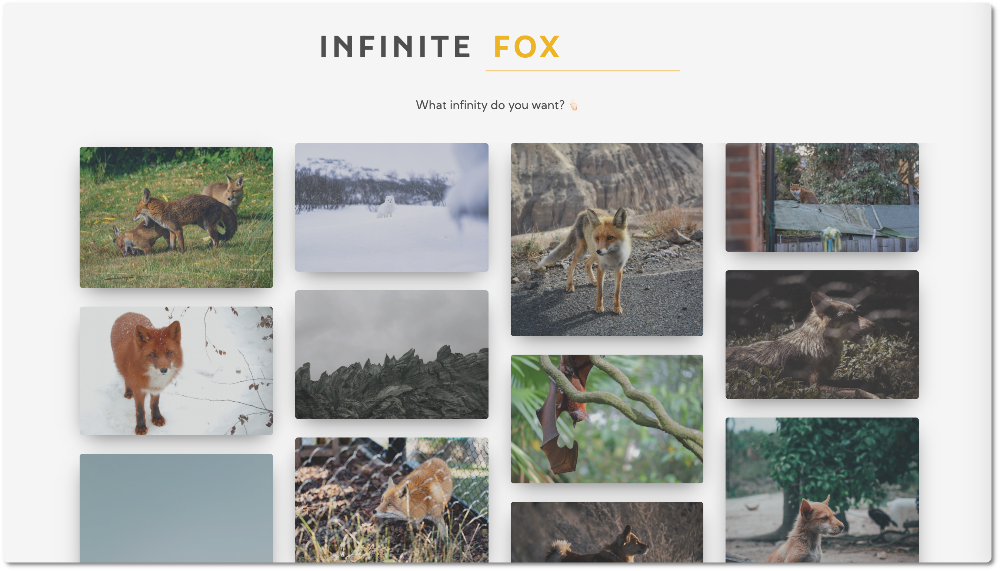

# Infinity Scroll






This app displays random pictures from unsplash. It implements **infinite scroll**, which loads more pictures as the user scrolls down. The pictures are fetched from the [Unsplash API](https://unsplash.com/documentation). In the title there is a title where the user can write a query word to get pictures related to their query. In these examples we see the results for 'mountain' and 'fox'. By default, it loads pictures related to nature.

It's also mobile responsive.


<br />


## Progress

The HTML will have three parts:

1. The title

2. The loader that will have a `hidden` attribute when the pictures are loaded.

   ```html
   <div class="loader" id="loader" hidden>
     
   </div>
   ```

3. The picture container where new `` will be created. 

   ```html
   <div class="image-container" id="image-container">
     
     // ...
   </div>
   ```

   

<br />


---


<br />

## Building a responsive Layout

1. Creating a container for the images 
2. Using media queries to make it look good on mobile
3. Using [columns](https://developer.mozilla.org/en-US/docs/Web/CSS/columns) property to display multiple pictures in different columns.


<br />


---


</br>


## Fetching data

👉🏻 Using  [Unsplash API](https://unsplash.com/documentation)

**Location:** `https://api.unsplash.com/photos/?client_id=YOUR_ACCESS_KEY` 👉🏻 we need API KEY that we pass as a query when requesting. I'll also be making use of the `query` parameter to allow users filter images by topic.

<br />

**Count:** In order to increase performance, the first fetch will only get 5 images for mobile devices and 15 for other screens (in order to make the column display look good). Whenever the first pack of pictures have been loaded, the count will then be the max of 30.

```js
// Unsplash API
// In phone first load is 5 pics, otherwise 15
const initialCount = window.innerWidth > 500 ? 15 : 5;
const regularCount = 30;
let isFirstLoad = true;
```


<br />

**Async function `getPhotos()`**

```js
// Using default parameters so that if the user doesn't write anything in the input, nature pics are displayed
async function getPhotos(query = 'nature') {
  let count; 

  // If it's first time load, count will be initialCount (5 / 15), otherwise regularCount (30)
  if (isFirstLoad) {
    count = initialCount;
  } else {
    count = regularCount;
  }

  const apiUrl = `https://api.unsplash.com/photos/random/?client_id=${apiKey}&count=${count}&query=${query}`;

  try {
    const response = await fetch(apiUrl);
    photosArr = await response.json(); // we save info in global array photosArr
    displayPhotos();
  } catch (error) {
    console.log(error);
  }
}
```


<br />


---


<br />


## Displaying the photos

We save the information into a global array, then with  `forEach` we create the html elements for each element. Because we are setting many attributes, we create a helper function to take care of this task:

```js
// Helper Function to Set Attributes on DOM Elements
function setAttributes(element, attributes) {
  for (const key in attributes) {
    element.setAttribute(key, attributes[key])
  }
}
```

⚠️ `photosArr` is indeed a **nodeList** and not an array, but `forEach` is now also supported for array-like structures.


<br />


```js
const elements = {
  imageContainer: document.getElementById('image-container'),
	loader: document.getElementById('loader'),
}

let photosArr = [];

function displayPhotos() {
  // Reset number of images loaded
  imagesLoaded = 0;
  // Update Total Nº of Images
  totalImages = photosArr.length;
  
  photosArr.forEach((photo) => {
    // Create <a> that links to Unsplash
    const item = document.createElement('a');
    setAttributes(item, {
      href: photo.links.html,
      target: '_blank',
    });

    // Create  for photo
    const img = document.createElement('img');
    setAttributes(img, {
      src: photo.urls.regular,
      alt: photo.alt_description || 'unknown', // avoid "null" when no description
      title: photo.alt_description || 'unknown',
    });

    // Put  inside of <a> and place them inside imageContainer
    item.appendChild(img);
    elements.imageContainer.appendChild(item);

    // Image was loaded
    imageLoaded(); // This is for the next step: checking if each image was loaded so that we can implament infinite scrolling
  });
}
```


<br />

---

<br />


## Infinite Scroll

As we scroll down, before we reach the end, we want our function `getPhotos` to run. For this purpose, we can use the `scroll` event (when an element's scrollbar is being scrolled) ([ref](https://developer.mozilla.org/en-US/docs/Web/API/Element/scroll_event))

<br />

We need to check if the scrolling is near bottom of page and then load more photos ⚠️ but only run the `getPhotos` function once. 

Ways of implementing infinite scroll functionality:

- `window.innerHeight`: the total height of the browser window
- `window.scrollY`: Distance from top of page user has scrolled (it goes up as user scrolls down)
- `document.body.offsetHeight`: height of everything in the body, including what is not within the view

We use the `offsetHeight` to subtract the amount of px that we want to load the pics.

```js
window.addEventListener('scroll', () => {
  if (document.innerHeight + window.scrollY >= document.body.offsetHeight - 1000) {
    getPhotos();
  }
})
```

⚠️ BUT this fires the function several times at once. 

<br />

We need to create a `ready` boolean that will only be true once the images have finished loading and only then the other statement must be evaluated. For this purpose, we'll use the  `load` event ([ref](https://developer.mozilla.org/en-US/docs/Web/API/SVGElement/load_event))

```js
// Check if all images were loaded
function imageLoaded() {
  imagesLoaded++;

  if (imagesLoaded === totalImages) {
    isFirstLoad = false; // this will later update our photos count
    ready = true;

    // Hide the Loader
    elements.loader.hidden = true;
  }
}
```

```js
// check when each is finished loading
img.addEventListener('load', imageLoaded)
```

Now we only want to scroll event listener run offloaded is equal to true (and then set to false)


<br />

----

Logo created with https://loading.io/

